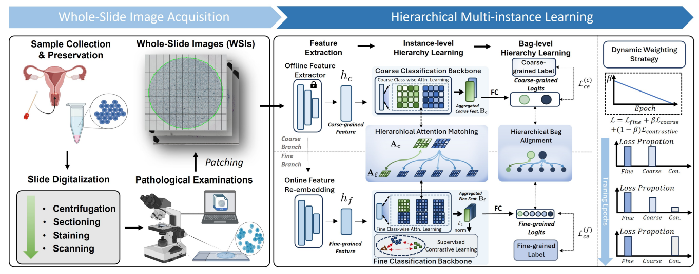

# HMIL
This repo is the official implementation of "HMIL: Hierarchical Multi-Instance Learning for Fine-Grained WSI Classification".

[[IEEE TMI]](https://ieeexplore.ieee.org/document/10810475) | [[arXiv]](https://arxiv.org/abs/2411.07660) | [[Preprocessing]](https://github.com/ChengJin-git/HMIL?tab=readme-ov-file#Preprocessing) | [[Workflow]](https://github.com/ChengJin-git/HMIL?tab=readme-ov-file#Workflow) | [[Citation]](https://github.com/ChengJin-git/HMIL?tab=readme-ov-file#Citation)

On Updating. Code will be released soon.

**Abstract**: Fine-grained classification of whole slide images (WSIs) is essential in precision oncology, enabling precise cancer diagnosis and personalized treatment strategies. The core of this task involves distinguishing subtle morphological variations within the same broad category of gigapixel-resolution images, which presents a significant challenge. While the multi-instance learning (MIL) paradigm alleviates the computational burden of WSIs, existing MIL methods often overlook hierarchical label correlations, treating fine-grained classification as a flat multi-class classification task. To overcome these limitations, we introduce a novel hierarchical multi-instance learning (HMIL) framework. By facilitating on the hierarchical alignment of inherent relationships between different hierarchy of labels at instance and bag level, our approach provides a more structured and informative learning process. Specifically, HMIL incorporates a class-wise attention mechanism that aligns hierarchical information at both the instance and bag levels. Furthermore, we introduce supervised contrastive learning to enhance the discriminative capability for fine-grained classification and a curriculum-based dynamic weighting module to adaptively balance the hierarchical feature during training. Extensive experiments on our large-scale cytology cervical cancer (CCC) dataset and two public histology datasets, BRACS and PANDA, demonstrate the state-of-the-art class-wise and overall performance of our HMIL framework. 

## Preprocessing
### Dataset Spliting
Adopt a k-fold cross-validation protocol to split the dataset. Then obtain a DATA_SPLIT.csv at the specified DATA_SPLIT_DIRECTORY.

### Patch Tiling
Build patches for each whole slide images at a certain resolution, refer to [ASlide](https://github.com/MrPeterJin/ASlide) or [CLAM](https://github.com/mahmoodlab/CLAM).

### Feature Extraction
Extract features for each whole slide images using a proper feature encoder, such as ResNet pretrained from ImageNet, [UNI](https://github.com/mahmoodlab/UNI) and etc. Then obtain the following folder structure at the specified FEATURE_DIRECTORY:
```bash
FEATURE_DIRECTORY/
	├── slide_001.pt
	├── slide_002.pt
	├── slide_003.pt
	└── ```
```

## Workflow

Train MIL models with Hierarchical Labels.

To be updated.

## Citation
If you find our work useful in your research or if you use parts of this code please consider citing our paper:
```bibtex
@article{jin2024hmil,
  title={HMIL: Hierarchical Multi-Instance Learning for Fine-Grained Whole Slide Image Classification},
  author={Jin, Cheng and Luo, Luyang and Lin, Huangjing and Hou, Jun and Chen, Hao},
  journal={IEEE Transactions on Medical Imaging},
  year={2024},
  publisher={IEEE}
}

```
